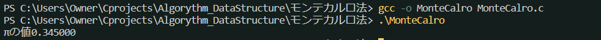
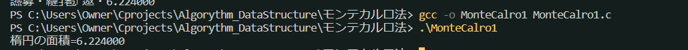

## モンテカルロ法とは
* ある問題を数値計算ではなく、確率（乱数）を用いて解くことをモンテカルロ法という。
* ばらまかれた乱数の数の比は面積に比例するので、これを利用して円周率$\pi$を測定できる

* エンコーディングがバグる問題を解決。プログラムをshift-JISで保存し直してgccコンパイルする。
* 因みに、モンテカルロとはモナコ公国の首都で、ギャンブルの町として有名。数値計算のように正確ではないため、この名前が付けられたそう。

### 楕円の面積
sを楕円の面積
n: 乱数の数
a: 楕円の中に入っている乱数の数s
$$ 2:s = n:a $$
