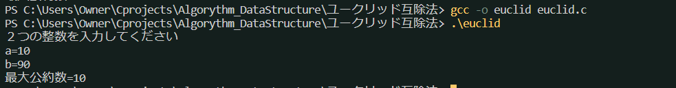

## ユークリッド互除法
* 2つの整数m, nの最大公約数を求めるアルゴリズム
* 通常の方法は、

> 二つの整数m, nがあるとき、,とnの最大公約数はm-nの最大公約数を求める方法に置き換えることができる
例えば、最大公約数をGとするとm=Gm', n=Gn'(m'とn'は互いに素)と書ける。
このとき、m-n = G(m'-n')が成り立ち、nと互いに素なm'とn'の差m'-n'は互いに素である。
つまり、m-nはnを要素に持たない。したがって、nとm-nの最大公約数はGとなる。

という原理に基づく。

* これをアルゴリズムとしてまとめると、
1. mとnが等しくない間以下を繰り返す
    
    1. if (m>n) m=m-n else n=n-m

3. m(またはn)が最大公約数である

* 数が大きいときは減算(m-n)の代わりに剰余(m%n)を用いたほうが効率が良い
1. mをnで割った余りをkとする
2. m=n, n=kとする
3. k==0 なら4へ。k!=0は1へ戻る
4. mは求める最大公約数である。

