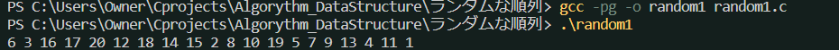
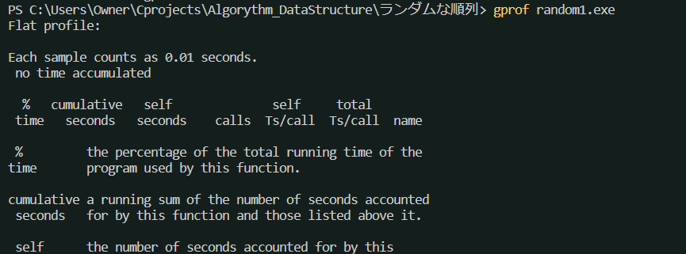

## ランダムな順列
1. 1-Nの乱数を一つ得る。
2. 以下をN-1回繰り返す
    1. 1-Nの乱数を一つ得る
    2. いままで作ってきた順列の中に入っていれば、1に戻る

## より効率の良いランダムな順列を得るアルゴリズム
1. a[1]-a[N]に1-Nの値をこの順に格納する
2. 1-N-1の範囲の乱数jを得る。a[j]とa[N]を入れ替える。
3. 1-N-2の範囲の乱数jを得る。a[j]とa[N-1]を入れ替える。
4. これをj=1, N=3まで繰り返す。

#### 計測?
* <a href="https://monoist.itmedia.co.jp/mn/articles/1711/15/news012_3.html">
    実行時間を計測するプログラムの使い方
    </a>
