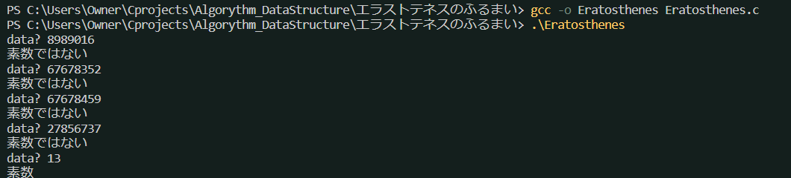
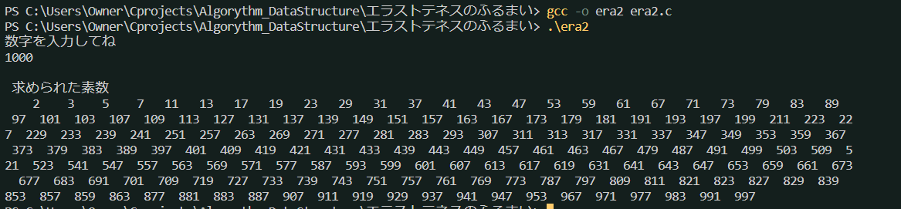
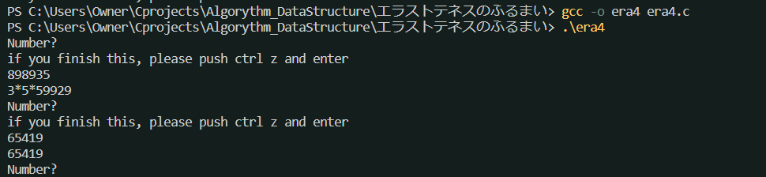

## 素数 era1.c
* nが素数か否かを判定するアルゴリズム
* 素数とは1と自分自身以外には約数を持たない数のこと

アルゴリズムは、nがnより小さい整数で割り切れるかを2まで繰り返し、もしなかったら素数と判定する。
まあ、n/2以上の数で割っても割り切れることはないので、直感的にはn/2から2までの数を調べればよいと分かる
数学的には$\sqrt s$からでよいことが分かっている。

やばい...なんか、昔の数学者が何で素数探しに一生懸命だったかちょっとわかったかも..
なんか、「これだけ数字が複雑なら素数でしょ！」って適当に打ってるのに素数じゃないの、く、悔しい...(;^ω^)

## 2-Nまでの全ての素数を求める era2.c
* 素数はprime[]に格納する?

## エラトステネスのふるまい era3.c
* 素数をもっと効率的に探すアルゴリズム
1. 2-nをすべてふるいにかける
2. 素数の倍数をすべてふるいから外す
3. nまで繰り返しふるいに残った数が素数である。

* 計算回数は$\frac{n \sqrt n}{2}$からめっちゃ減る。（各所で倍数判定されたらすっ飛ばすから）

## 素因数分解 era4.c
$$ 126 = 2*3*3*7 $$

アルゴリズム
1. nを2で割り切れなくなるまで繰り返し割っていく
2. 割る数を3, 4, 5, 6と変えて割っていく。（手元に素数表がないので、手あたり次第割っている。）
3. 割る数をaとするとき、$n>=a*a$が2をくりかえす条件である。

