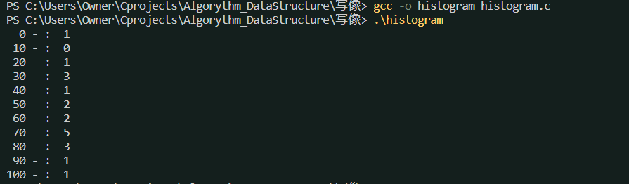
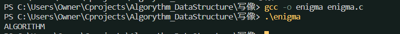
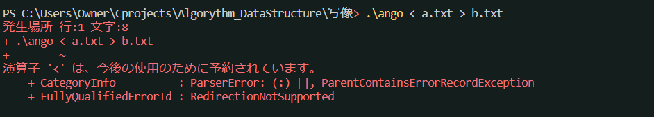
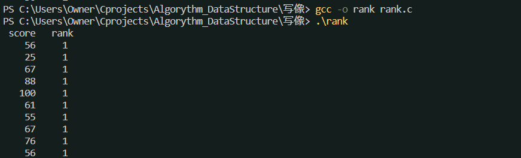
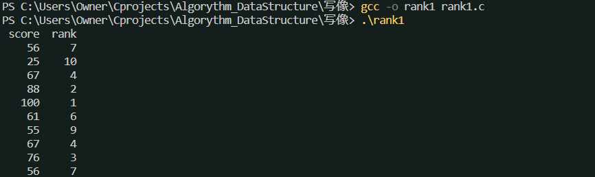
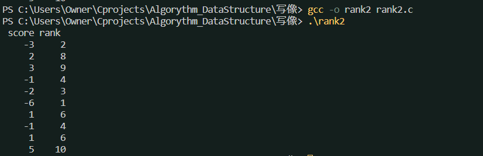

目次
[ヒストグラム](#ヒストグラム-histogramc)
[暗号](#暗号-enigmac)
[順位付け](#順位づけ-rankc)
[効率の良い計算方法](#効率の良い計算方法-rank1c)
[負のデータの順位付け](#負のデータの順位付け-rank2c)

## ヒストグラム histogram.c

* ヒストグラムはデータ範囲[0-100]から[0-10]の範囲に写像することと考えることができる
* 定義域と地域のデータ型は異なっていて良い

## 暗号 enigma.c

#### 暗号の種類
* シーザー暗号：アルファベットを一定幅でずらす
* 排他的論理和による暗号：
I/Oダイレクトによるテキストファイルで暗号化と解読ができる？


### 本格的な暗号 
* DES
* FEAL

## 順位づけ rank.c
* 順位を調べる値を超える点数がある度にrank変数を+1する。
* 同点数の場合も、自分を超える点数の数を数えるので同順位になる。


### 効率の良い計算方法 rank1.c


## 負のデータの順位付け rank2.c

* 範囲指定ができる言語(Pascal, Visual Basic)と、できない言語（C言語）がある
* C言語は部分範囲指定ができない言語なので、下のように変数を定義する。
```c
#define Num 10
#define Max 36
#define Min -20
#define Bias 1-(Min)
```