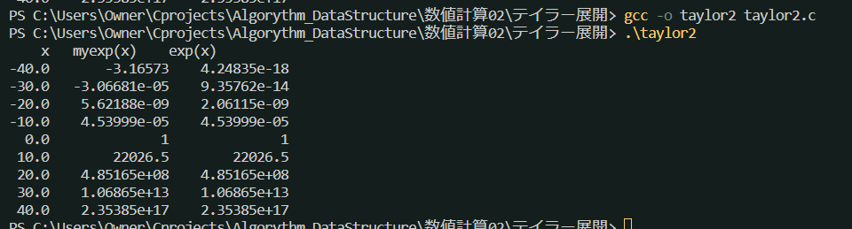
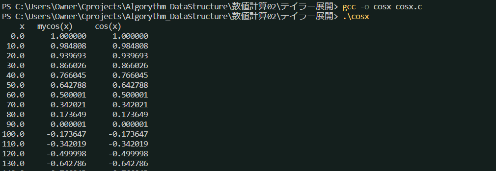

# テイラー展開
* 式が無限級数になるので、実際に計算する際には有限回で打ち切る必要がある
* 打ち切る条件はk-1項までの和をd, k項までの和をsとしたとき、
$$ \frac{|s-d|}{|d|} < EPS $$
となった時である

* $|s-d|$を打ち切り誤差, $\frac{|s-d|}{|d|}$を早退打切り誤差という。
* EPSの値は必要な精度に応じて適当に設定する。EPS=1e-8では制度は8桁程度であると考えてよい。

## 負の場合
* $e^x$におけるxが負の値であるような場合に、真値に対してきわめて大きな数の加算・減算を繰り返すことにより、桁落ちを生じるので誤差は極めて大きくなる。

$$ e^{-40} = 1 - 40 + 800 - 10666 + 106666 - 853333 +....$$

因みに、真値は$4.24354 × 10^{-18}$になる。
そこで、xが負の場合は
$$ e^{-x} = \frac{1}{e^x}$$
として求める

* あれ..なんかこれ違くない(;^ω^)

## cos(x)

