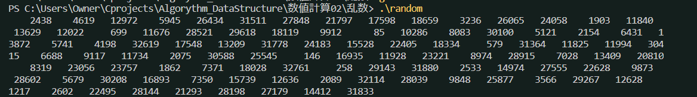
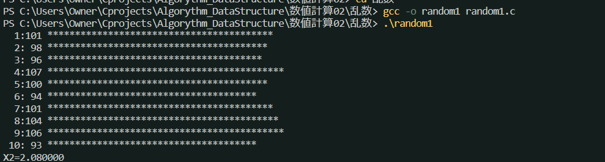
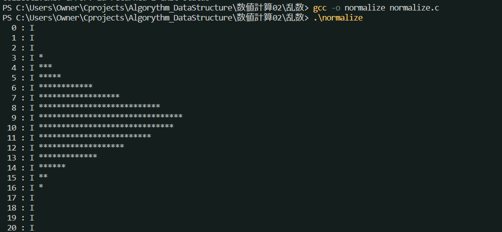

# 線形合同法
* 乱数とは：何の規則性もなく、でたらめに発生する数のこと
* 擬似乱数：計算によって求められた乱数

$$ x_n = (Ax_{n-1} + C) mod M$$

次々に0-Mの範囲の値を発生させる。
$$ 
M = 2^n \\
A = 5 mod 8 \\
Cが奇数
$$
という条件で0^M-1までの整数が周期Mで一回ずつ現れる。
* このように、各値が均一に現れる乱数を一様乱数という。
* 例のプログラムではA=109, C=1021, x_0 = 13, M=32768を用いた。

## 一様性の検定
* どのくらい均一にばらまかれているのかをX^2（カイ2乗検定）の手法で計算する
* 乱数が1-Mの範囲で発生するとき、iの値の発生回数を$f_i$、iの発生期待値を$F_i$とすると、
$$$ X^2 = \sum^M_{i=1} \frac{(f_i - F_i)^2}{F_i}$$
の値が小さいほど、均一にばらまかれていることを示す。

## 正規乱数をボックスミュラー法により発生させる
$$N(m, n) = \frac{1}{\sigma \sqrt{2\pi}} e - \frac{(x-m)^2}{2\sigma^2}$$

$$x = \sigma \sqrt{-2 log r_1} cos2\pi r_2 + m$$
$$y = \sigma \sqrt{-2 log r_1} sin2\pi r_2 + m$$

### 各種乱数
* コンピュータの乱数は一様乱数が基本となっている。
* これを用いて、正規乱数、に請う乱数、ポアソン乱数、指数乱数、ワイブル乱数、ガンマ乱数などの各種乱数を作ることができる。

### 一様性の検定
* 線形合同法に依る乱数は一つずつ使えばかなり一様だが、いくつかの組にして使うとあまり一様にならない
* したがってウォーミングアップで求めた$\pi$はあまり正確ではない
* 線形合同法より良いとされる乱数にM系列乱数がある。