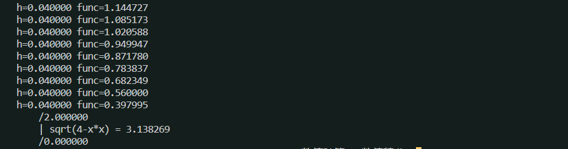
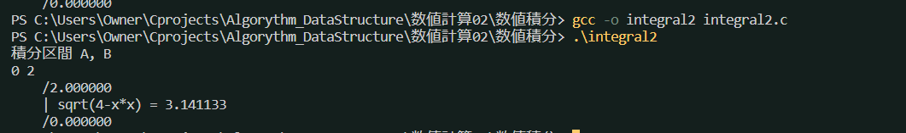

# 数値積分　
## 台形則 integral.c
* 数値積分とは：定積分を解析的に数式として求めるのではなく、微小区間に分割して近似値として求める方法
* integral.cは$y = 4- x*x$について計算しているが、sqrt()関数の仕様で、-2~2までしか計算できない(正の部分)（引数は整数であるという制限）

## シンプソン則による定積分 integral2.c
* 台形則では直線で微小区間を近似するのに対し、シンプソン則では2次曲線を用いて近似する

## 数値積分の公式として有名なモノ

* ニュートン・コーツ系の公式：区間を等間隔に分割する公式
    * 直線近似
        * 台形則、中点則
    * 2次曲線近似
        * シンプソン則
* チェビシェフの公式：区間を不等間隔で重みを一定にする
* ガウスの公式：区間を不等間隔で重みも一定でない方式
* うーん、この辺の数式はあとでノートにまとめておこう