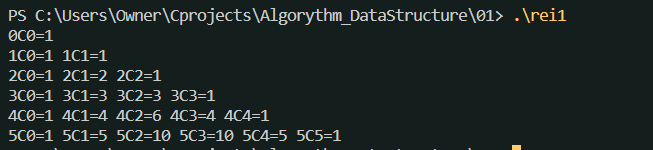
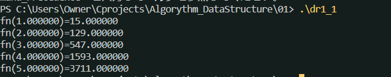
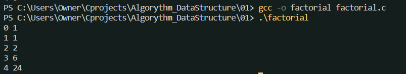
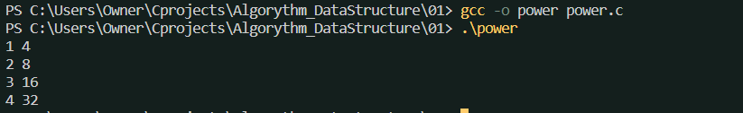
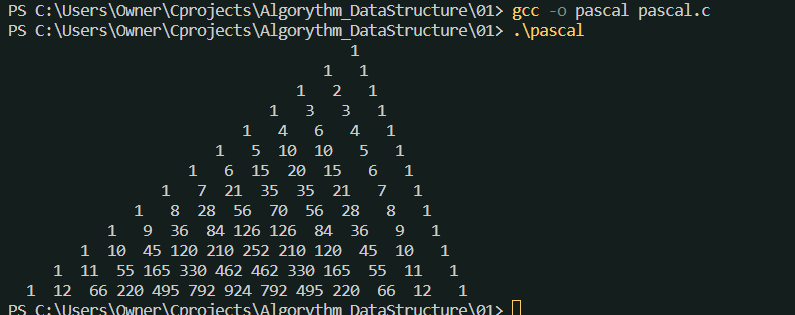

## ウォーミングアップ

### 漸化式
* 組み合わせを示すnCrは、漸化式で示すことでオーバーフロー(int型なら整数8桁になるとオーバーフローする、今回の場合は10!でオーバーフロー)を防ぐことができる。
$${}_nC_r = \frac{n!}{r!(n-r)!} $$
を、
$${}_nC_r = \frac{n-r+1}{r}{}_nC_{r-1} $$
$${}_nC_0 = 1$$
として計算する。

#### 多項式（ホーナーの方法）

$$f(x) = a_nx^n + a_{n-1}x^{n-1} + ... + a_1x + a_0 $$

を、
$$
f_i = f_{i-1}x + a_{n-i}\\
f_0 = a_n
$$
という漸化式で示すことができる。
これをHonerの方法という。計算回数は
$$\frac{n(n+1)}{2} + n$$
回から、n回の足し算とn回の掛け算まで落とせる。

### 階乗
$$
n! = n(n-1)!\\
0! = 1
$$

### べき乗$x^n$
$$
x^n = x*x^{n-1}\\
x^0 = 1
$$

### フィボナッチ数列 開発中
$$1, 1, 2, 3, 5, 8, 13....$$
$$
F_n = F_{n-1} + F_{n-2}\\
F_1 = F_2 = 1
$$

### テイラー展開 開発中

### パスカルの三角形
